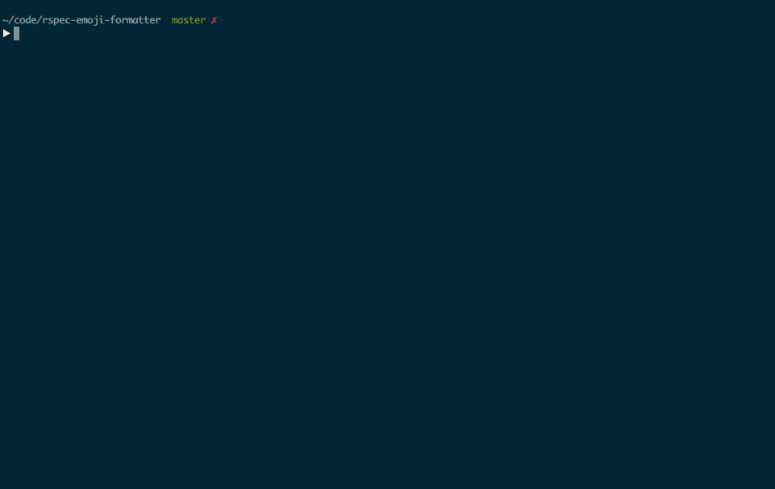

# EmojiFormatter

A custom formatter for Rspec. Spice up your boring test suite with some 😀

Did your test pass? 😀 Did your test fail? 😡 Is your test pending? 🔷

## Usage
Install the gem:

`gem install emoji-formatter`

Then choose it as your RSpec formatter:

`rspec --format EmojiFormatter`

Or add this line to your `.rspec` file:

`--format EmojiFormatter`

Enjoy!
